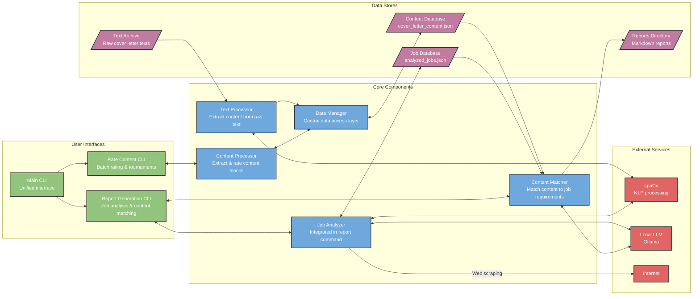

# Cover Letter Wizard

CoverLetter Wiz is an AI-powered tool that helps you improve and evolve your job application materials—especially cover letters—over time. Instead of treating editing as a linear process, the tool supports a more organic, granular workflow. It lets you identify, compare, and refine individual segments of your text—like sentences or paragraphs—while preserving the results of earlier refinements and insights.

Built on natural language processing (NLP) techniques like named entity recognition (NER), noun chunk extraction, and pattern-based keyword detection, CoverLetter Wiz turns unstructured text into structured insights. It primarily relies on spaCy and local LLMs via Ollama to accomplish these tasks. These insights help surface key themes, skills, and phrases that matter to both you and potential employers—so you can focus your improvements on what's most relevant.

## License

This project is released under the [CC0 1.0 Universal (CC0 1.0) Public Domain Dedication](https://creativecommons.org/publicdomain/zero/1.0/). You can copy, modify, distribute and perform the work, even for commercial purposes, all without asking permission.

## Project Structure

This project uses a specific directory structure to maintain privacy and separation of concerns:

```
coverletter_container/
├── coverletter_wiz/     # Main application code (git repository)
│   ├── coverletter_wiz/ # Core application modules
│   ├── tests/           # Test suite
│   └── ...              # Other application files
│
├── coverletter_data/    # Personal data (separate git repository)
│   ├── config/          # Configuration files
│   ├── json/            # JSON data files
│   ├── text-archive/    # Archive of text files
│   └── ...              # Other data files
│
└── coverletter_archive/ # Archived code and data (separate git repository)
    ├── job-reports/     # Archived job reports
    ├── json_archives/   # Archived JSON data
    └── ...              # Other archived files
```

## Data Privacy

For privacy reasons, personal data is stored in separate git repositories (`coverletter_data` and `coverletter_archive`) outside the main application repository. This separation allows you to:

1. Keep your personal job application data private while still being able to share the application code
2. Version control your data separately from the application code
3. Apply different access controls to your personal data

The application is configured to look for the data directory one level up from the application directory. This ensures that your personal data is not accidentally committed to the main repository.

### Privacy-First Approach

CoverLetter Wiz is designed with privacy as a core principle:

- **100% Local Processing**: All processing happens on your local machine. Your personal information never leaves your computer.
- **No External APIs**: The application uses locally-run models (spaCy and Ollama) for all NLP and AI tasks.
- **Limited Internet Access**: The only external interaction is fetching job postings from the web when explicitly requested.
- **Separate Data Storage**: Your private data is stored in a completely separate git repository from the application code.
- **No Telemetry**: The application does not collect or transmit any usage data or personal information.

This approach ensures that you maintain complete control over your personal information while still benefiting from advanced AI-powered analysis.

## System Overview

Cover Letter Wizard integrates several key components:

1. **Content Processing**: Extract, rate, and refine content blocks from your existing cover letters
2. **Content Matching**: Match your high-rated content to job requirements
3. **Report Generation**: Generate comprehensive reports and draft cover letters

## System Architecture



## Architecture & Data Flow

CoverLetter Wiz uses a modular architecture with separated processing, rating, and content matching components. The data flow follows a single-source-of-truth pattern centered around the DataManager component:

1. **Text Processing**: The TextProcessor reads raw text files from your archive and extracts structured content, writing directly to the canonical content database via the DataManager.

2. **Central Data Management**: All components access data through the DataManager, which provides a unified interface to the content database, ensuring consistency and preventing synchronization issues.

3. **Content Rating**: The ContentProcessor provides various rating workflows (batch rating, tournaments, category refinement) to help you identify your strongest content.

4. **Content Matching**: The ContentMatcher combines your rated content blocks with job requirements to help you create targeted cover letters.

The system follows these core design principles:

- **Single Source of Truth**: All data is managed by the DataManager to maintain consistency
- **Separation of Concerns**: Each component has a specific, focused responsibility
- **Data Persistence**: All ratings and edits are preserved across processing runs
- **Progressive Refinement**: Content is continuously improved through multiple rating workflows

## Key Features

### Intelligent Keyword Management
- **Semantic Keyword Matching**: Uses spaCy's NLP capabilities to match keywords to content based on semantic similarity rather than exact matches
- **Automatic Category Assignment**: New keywords are automatically assigned to the most semantically similar category
- **Keyword Persistence**: Keywords can be saved to the categories.yaml file for future use
- **Content Re-tagging**: Content blocks are automatically re-tagged when new keywords are added

### Privacy-First Design
- **Data Separation**: Personal data is stored in a separate repository from the application code
- **Local Processing**: All NLP and LLM processing is done locally on your machine
- **No External Data Sharing**: Your private information is never shared with external services
- **Separate Git Repositories**: Different access controls can be applied to code vs. personal data

### Semantic Content Matching
- **Intelligent Tag Prioritization**: Job requirements are analyzed and prioritized based on semantic relevance
- **Content Block Scoring**: Content blocks are scored based on both their rating and semantic match to job requirements
- **Content Gaps Analysis**: Reports identify missing high-quality content for important tag categories

## Application Structure

```
coverletter_wiz/
├── __init__.py          # Package initialization
├── __main__.py          # Main entry point
├── core/                # Core functionality
│   ├── __init__.py
│   ├── content_processor.py  # Content extraction and rating
│   └── content_matcher.py    # Content matching and reporting
├── cli/                 # Command-line interfaces
│   ├── __init__.py
│   ├── rate_content.py  # Content rating CLI
│   └── generate_report.py # Report generation with job analysis and content matching
├── utils/               # Utility modules
│   ├── __init__.py
│   ├── spacy_utils.py   # NLP processing utilities
│   └── html_utils.py    # HTML content extraction utilities
├── config.py            # Configuration for external data access
├── reports/             # Generated reports
├── templates/           # Template files
└── requirements.txt     # Dependencies
```

## Key Terms

- **Content Block**: A unit of text from a cover letter (sentence or group of sentences) that can be rated and matched to job requirements
- **Content Group**: Multiple sentences that form a coherent unit for rating and matching
- **Job Tags**: Keywords or phrases extracted from job postings and categorized by priority
- **Rating System**: A scale from 1-10 used to rate content blocks, with tournament-style refinement
- **Match Score**: A weighted score indicating how well a content block matches a job's requirements
- **Legend Content**: Top-rated content blocks (rating ≥ 10.0) that compete in specialized tournaments

## Versioning

This project follows [Semantic Versioning](https://semver.org/) (SemVer):
- **MAJOR** version for incompatible API changes
- **MINOR** version for backwards-compatible functionality additions
- **PATCH** version for backwards-compatible bug fixes

You can find the current version in `src/__init__.py` and view the complete history of changes in the [CHANGELOG.md](./CHANGELOG.md).

## Usage

### Main Commands

The application provides the following main commands:

```bash
# Process text files from the default archive directory
python -m coverletter_wiz process

# Process with force reprocessing of all files
python -m coverletter_wiz process --force

# Rate content with various workflows
python -m coverletter_wiz rate [batch|tournament]

# Generate a job report and cover letter
python -m coverletter_wiz report --job-id 123

# Export content to text or markdown
python -m coverletter_wiz export [text|markdown]
```

### Configuration

The report command can be configured using a JSON configuration file:

```bash
# Generate a report with custom configuration
python -m coverletter_wiz report --job-id 123 --config path/to/config.json
```

Example configuration file (config.json):
```json
{
  "min_rating": 6.0,
  "content_weight": 0.7,
  "weights": [3, 2, 1, 0.1],
  "similarity_threshold": 0.8,
  "include_cover_letter": true,
  "use_semantic_dedup": true
}
```

### Additional Options

```bash
# Add extra tags to prioritize in matching
python -m coverletter_wiz report --job-id 123 --tags python django

# Show preprocessed job text in the report
python -m coverletter_wiz report --job-id 123 --show-preprocessed

# Use a different LLM model
python -m coverletter_wiz report --job-id 123 --llm-model llama3
```

## Setup

1. Clone the main application repository:
   ```
   git clone <repository-url> coverletter_wiz
   ```

2. Create data directories in the parent folder:
   ```
   mkdir -p ../coverletter_data
   cd ../coverletter_data
   git init
   ```

3. Create and activate a virtual environment:
   ```bash
   cd ../coverletter_wiz
   python -m venv .venv
   source .venv/bin/activate  # On Windows: .venv\Scripts\activate
   ```

4. Install the requirements:
   ```bash
   pip install -r requirements.txt
   ```

5. Install the spaCy model:
   ```bash
   python -m spacy download en_core_web_lg
   ```

6. Install Ollama and ensure it's running (for LLM functionality)

## Development

This project was developed through pair programming with AI assistants, specifically GPT-4o and Claude Sonnet 3.7. This collaborative approach enabled rapid development while maintaining high code quality and comprehensive documentation.
