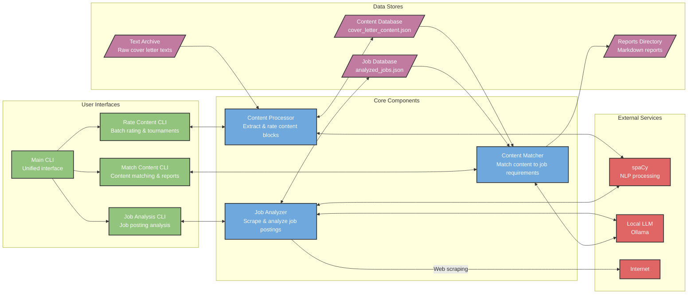

# Cover Letter Wizard

CoverLetter Wiz is an AI-powered tool that helps you improve and evolve your job application materials—especially cover letters—over time. Instead of treating editing as a linear process, the tool supports a more organic, granular workflow. It lets you identify, compare, and refine individual segments of your text—like sentences or paragraphs—while preserving the results of earlier refinements and insights.

Built on natural language processing (NLP) techniques like named entity recognition (NER), noun chunk extraction, and pattern-based keyword detection, CoverLetter Wiz turns unstructured text into structured insights. It primarily relies on spaCy and local LLMs via Ollama to accomplish these tasks. These insights help surface key themes, skills, and phrases that matter to both you and potential employers—so you can focus your improvements on what's most relevant.

## Project Structure

This project uses a specific directory structure to maintain privacy and separation of concerns:

```
coverletter_container/
├── coverletter_wiz/     # Main application code (git repository)
│   ├── coverletter_wiz/ # Core application modules
│   ├── tests/           # Test suite
│   └── ...              # Other application files
│
├── coverletter_data/    # Personal data (separate git repository)
│   ├── config/          # Configuration files
│   ├── json/            # JSON data files
│   ├── text-archive/    # Archive of text files
│   └── ...              # Other data files
│
└── coverletter_archive/ # Archived code and data (separate git repository)
    ├── job-reports/     # Archived job reports
    ├── json_archives/   # Archived JSON data
    └── ...              # Other archived files
```

## Data Privacy

For privacy reasons, personal data is stored in separate git repositories (`coverletter_data` and `coverletter_archive`) outside the main application repository. This separation allows you to:

1. Keep your personal job application data private while still being able to share the application code
2. Version control your data separately from the application code
3. Apply different access controls to your personal data

The application is configured to look for the data directory one level up from the application directory. This ensures that your personal data is not accidentally committed to the main repository.

## System Overview

Cover Letter Wizard integrates several key components:

1. **Content Processing**: Extract, rate, and refine content blocks from your existing cover letters
2. **Job Analysis**: Analyze job postings to extract requirements and key information
3. **Content Matching**: Match your high-rated content to job requirements
4. **Report Generation**: Generate comprehensive reports and draft cover letters

## System Architecture



## Application Structure

```
coverletter_wiz/
├── __init__.py          # Package initialization
├── __main__.py          # Main entry point
├── core/                # Core functionality
│   ├── __init__.py
│   ├── content_processor.py  # Content extraction and rating
│   ├── job_analyzer.py       # Job posting analysis
│   └── content_matcher.py    # Content matching and reporting
├── cli/                 # Command-line interfaces
│   ├── __init__.py
│   ├── rate_content.py  # Content rating CLI
│   ├── analyze_job.py   # Job analysis CLI
│   └── match_content.py # Content matching CLI
├── utils/               # Utility modules
│   ├── __init__.py
│   └── spacy_utils.py   # NLP processing utilities
├── config.py            # Configuration for external data access
├── reports/             # Generated reports
├── templates/           # Template files
└── requirements.txt     # Dependencies
```

## Key Terms

- **Content Block**: A unit of text from a cover letter (sentence or group of sentences) that can be rated and matched to job requirements
- **Content Group**: Multiple sentences that form a coherent unit for rating and matching
- **Job Tags**: Keywords or phrases extracted from job postings and categorized by priority
- **Rating System**: A scale from 1-10 used to rate content blocks, with tournament-style refinement
- **Match Score**: A weighted score indicating how well a content block matches a job's requirements
- **Legend Content**: Top-rated content blocks (rating ≥ 10.0) that compete in specialized tournaments

## Versioning

This project follows [Semantic Versioning](https://semver.org/) (SemVer):
- **MAJOR** version for incompatible API changes
- **MINOR** version for backwards-compatible functionality additions
- **PATCH** version for backwards-compatible bug fixes

You can find the current version in `src/__init__.py` and view the complete history of changes in the [CHANGELOG.md](./CHANGELOG.md).

## Setup

1. Clone the main application repository:
   ```
   git clone <repository-url> coverletter_wiz
   ```

2. Create data directories in the parent folder:
   ```
   mkdir -p ../coverletter_data
   cd ../coverletter_data
   git init
   ```

3. Create and activate a virtual environment:
   ```bash
   cd ../coverletter_wiz
   python -m venv .venv
   source .venv/bin/activate  # On Windows: .venv\Scripts\activate
   ```

4. Install the requirements:
   ```bash
   pip install -r requirements.txt
   ```

5. Install the spaCy model:
   ```bash
   python -m spacy download en_core_web_lg
   ```

6. Install Ollama and ensure it's running (for LLM functionality)

## Usage

### Unified CLI (Recommended)

```bash
# Rate content blocks in batch mode (initial rating)
python coverletter_wiz.py rate --batch

# Run tournament mode for comparing content blocks by category
python coverletter_wiz.py rate --tournament

# Run legends tournament for highest-rated content
python coverletter_wiz.py rate --legends

# Run category refinement mode to organize content by topic
python coverletter_wiz.py rate --refinement

# View statistics about your content blocks
python coverletter_wiz.py rate --stats

# Export high-rated content blocks to markdown
python coverletter_wiz.py rate --export --min-rating 8.0

# Analyze a job posting
python coverletter_wiz.py job --url "https://example.com/job-posting"

# Match content to a job and generate a cover letter
python coverletter_wiz.py match --job-id 1 --report --cover-letter
```

### Individual Component CLIs

```bash
# Rate content blocks in batch mode
python -m coverletter_wiz.cli.rate_content --batch

# Run tournament mode for comparing content blocks
python -m coverletter_wiz.cli.rate_content --tournament

# Run legends tournament for highest-rated content
python -m coverletter_wiz.cli.rate_content --legends

# Export high-rated content blocks to markdown
python -m coverletter_wiz.cli.rate_content --export --min-rating 8.0

# Analyze a job posting
python -m coverletter_wiz.cli.analyze_job --url "https://example.com/job-posting"

# Match content to a job and generate a cover letter
python -m coverletter_wiz.cli.match_content --job-id 1 --report --cover-letter
```

## Content Rating System

The Cover Letter Wizard uses a sophisticated rating system to evaluate and improve your cover letter content:

### Batch Rating

Initial rating of content blocks on a 1-10 scale:
- 1-2: Poor (filtered out)
- 3-5: Fair to Average
- 6-7: Good
- 8-10: Excellent

### Tournament Mode

Compare content blocks within categories to refine ratings:
- Content blocks compete against each other in head-to-head comparisons
- Winners gain rating points, losers lose points
- Categories track completion and refinement status
- Helps identify your best content in each category

### Legends Tournament

Special tournament mode for your absolute best content:
- Only content blocks rated 10.0 or higher qualify as "legends"
- Extended rating scale (up to 12.0) for finer differentiation
- Cross-category competition to identify your very best material
- Prevents rating inflation by requiring tougher competition

### Category Refinement

Organize and improve content by topic:
- View completion status for each category
- Focus on categories that need more work
- Track refinement progress across your entire content library
- Seamlessly switch between refinement and tournament modes

### Export Functionality

Export your best content for easy use in cover letters:
- Export content blocks above a specified rating threshold
- Organized by category for easy reference
- Includes detailed statistics and metadata
- Markdown format for easy integration into documents

## Data Flow

1. **Content Processing**: Raw cover letter texts are processed into content blocks, which are stored in `cover_letter_content.json`
2. **Content Rating**: Content blocks are rated through batch rating, tournaments, and refinement processes
3. **Job Analysis**: Job postings are scraped and analyzed, with results stored in `analyzed_jobs.json`
4. **Content Matching**: High-rated content blocks are matched to job requirements
5. **Report Generation**: Reports are generated in the `reports` directory, including matching content and cover letter drafts

## External Dependencies

- **spaCy**: Used for natural language processing, tag extraction, and content analysis
- **Ollama**: Used for running local LLMs for job analysis and cover letter generation
- **BeautifulSoup**: Used for web scraping job postings
- **PyYAML**: Used for configuration file parsing
